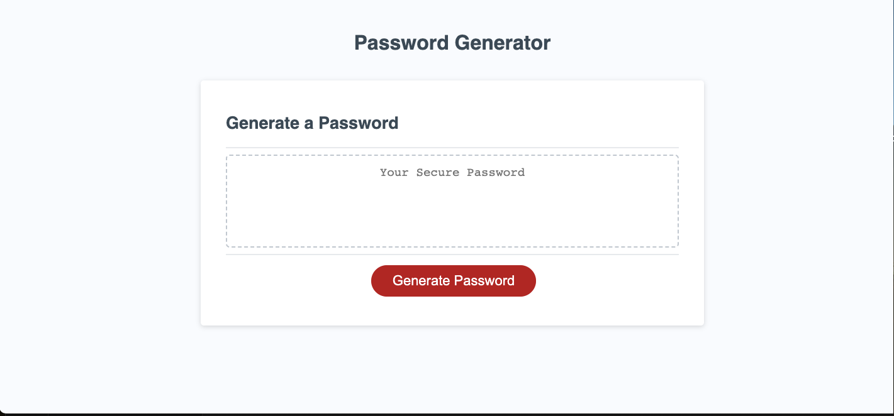

# passwordgenerator

## Description

This project is a password generator for people to use in order to generate various random passwords. I built this project in order to create something that can provide a random password. Currently, people are not using secure enough passwords and are being "hacked". If they use this password generator, their passwords will be more secure and impossible to guess.

## Table of Contents 

- [Installation](#installation)
- [Usage](#usage)
- [Credits](#credits)
- [License](#license)

## Installation

There is no installation needed. This program can be used in any web browser.

## Usage

## Credits

My only collaborator was a tutor.

## License

N/A

---